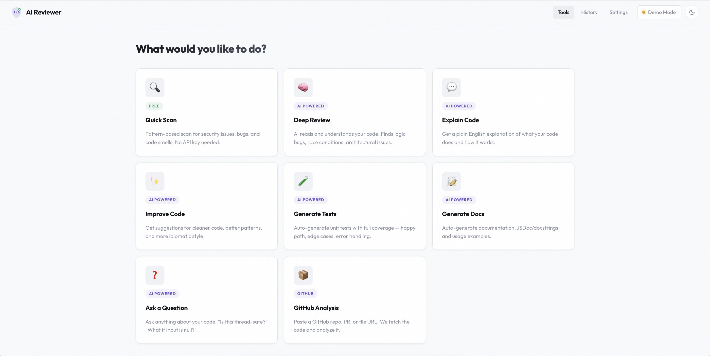

<div align="center">

# AI Code Review Assistant

[](https://github.com/OmkumarSolanki/ai-code-review)
[](https://github.com/OmkumarSolanki/ai-code-review)
[](LICENSE)
[](https://ai-code-review.fly.dev)
[](https://www.typescriptlang.org/)
[](https://nodejs.org/)

**A hybrid code analysis platform that combines pattern matching, AST parsing, and LLM intelligence to review code in 50+ languages.**

Three independent engines analyze your code in parallel, cross-validate findings, validate suggested fixes, and score your code's health — all from a single web interface.

**<a href="https://ai-code-review.fly.dev" target="_blank">Live Demo</a>** | Try it now — Quick Scan works for free, no API key needed.

</div>

---

## Demo

### Available Tools



---

## What Makes This Different

Most code review tools do ONE thing. This does three — and cross-checks them:

| Engine | What It Does | Works On | Cost |
|--------|-------------|----------|------|
| **Pattern Scanner** | 15+ regex rules catch hardcoded secrets, SQL injection, eval(), XSS, shell injection | All 50+ languages | Free |
| **ESLint** | 14 AST-aware rules detect unused vars, complexity > 10, loose equality, missing error handling | JavaScript / TypeScript | Free |
| **LLM Analysis** | AI finds logic bugs, race conditions, architectural issues, and suggests specific fixes | All languages | API key |

When two engines flag the same line, **severity is automatically boosted** — multi-source agreement means higher confidence. Suggested fixes are **validated with Tree-sitter** before being shown, so you never see a fix that introduces syntax errors.

---

## Features

### 8 Analysis Tools

| Tool | What It Does |
|------|-------------|
| **Quick Scan** | Full hybrid pipeline: pattern scanner + ESLint + LLM. Returns per-file health scores (0-100), a LOC-weighted project score, findings with code snippets, and validated fixes. **Free, no API key.** |
| **Deep Review** | AI reviews code for logic bugs, race conditions, missing error handling, data flow issues, and architectural problems. Returns markdown with exact line references. |
| **Explain Code** | Structured explanation: overview, step-by-step logic walkthrough, key patterns/algorithms, dependencies, and gotchas. |
| **Improve Code** | Before/after code comparisons rated by impact (High/Medium/Low). Covers readability, idioms, SOLID, performance, robustness. |
| **Generate Tests** | Complete, runnable test files. Picks the right framework (Jest for TS/JS, pytest for Python, JUnit for Java). Covers happy path, edge cases, error cases. |
| **Generate Docs** | JSDoc, Google-style docstrings, or Javadoc depending on language. Includes module overview, parameter docs, and usage examples. |
| **Ask a Question** | Free-form Q&A: "Is this thread-safe?", "What if input is null?", "Explain line 42". Answers reference exact line numbers. |
| **GitHub Import** | Paste a repo/PR/file URL. Code is fetched via GitHub REST API, filtered (skips `node_modules`, `.git`, binaries), and ready for any tool. |

### LLM Provider Support

Swap providers from the settings UI — no restart needed:

| Provider | Default Model | Fallback |
|----------|--------------|----------|
| **Demo** (default) | Pre-cached responses | Always available, zero cost, deterministic |
| **OpenAI** | GPT-4o | Falls back to Demo if key missing |
| **Anthropic** | Claude Sonnet 4.6 | Falls back to Demo if key missing |
| **Google** | Gemini 2.5 Flash | Falls back to Demo if key missing |

---

## Architecture Overview

```
Upload / Paste / GitHub Import
         |
    File Processing ── language detection, binary filtering, SHA-256 hashing
         |
    AST Parsing ────── Tree-sitter extracts functions, imports, classes, complexity
         |
    Dependency Graph ── BFS finds connected components from import relationships
         |
    Smart Batching ──── first-fit-decreasing bin packing within token budget
         |
    +----+----+
    |         |
    v         v
 Static    LLM         ← run in parallel via Promise.allSettled
Analysis  Analysis       (if LLM fails, static results still returned)
    |         |
    +----+----+
         |
    Aggregation ──── deduplicate across sources, boost severity on agreement
         |
    Fix Validation ── Tree-sitter syntax check + pattern regression + ESLint regression
         |
    Health Scoring ── per-file (0-100) + LOC-weighted project score
         |
    Results (cached by content hash)
```

**Key design principles:**
- **Graceful degradation** — if the LLM fails, static analysis results are still returned
- **Cross-validation** — findings from 2+ engines get severity boosted (warning → critical)
- **Fix validation** — every suggested fix is re-parsed; if it adds syntax errors, it's rejected
- **Content-hash caching** — re-analyzing unchanged files is instant (same principle as Git)

---

## Supported Languages

**Full AST Parsing (Tree-sitter WASM):** JavaScript, TypeScript, TSX, Python, Java, Go, Rust, C, C++, Ruby, PHP

**Enhanced Analysis (AST + ESLint):** JavaScript, TypeScript

**Pattern Scanning + LLM:** All text files — `.ts` `.js` `.py` `.java` `.go` `.rs` `.rb` `.cpp` `.c` `.cs` `.php` `.swift` `.kt` `.scala` `.sql` `.sh` `.dockerfile` `.tf` `.graphql` `.prisma` `.xml` `.toml` `.yaml` and more (37+ extensions)

---

## Tech Stack

| Layer | Technology | Why |
|-------|-----------|-----|
| **Runtime** | Node.js 20, TypeScript (strict) | Async I/O for parallel API calls; strict mode catches null bugs at compile time |
| **Server** | Express 5 | Apollo Server middleware for GraphQL+REST on one port; native async error handling |
| **API** | REST + GraphQL (Apollo Server 4) | REST for simple CRUD; GraphQL subscriptions for real-time batch progress |
| **Real-time** | graphql-ws over WebSocket | Stream batch completions to UI as they happen (not polling) |
| **Database** | SQLite via Prisma ORM | Zero infrastructure; type-safe queries; automatic migrations; cuid() for IDs |
| **AST** | web-tree-sitter (WASM) | One universal parser for 11 languages; no native C build tools needed |
| **Static Analysis** | Custom pattern scanner + ESLint 10 | Pattern scanner: free, deterministic, all languages. ESLint: scope-aware, JS/TS only |
| **LLM** | OpenAI SDK, Anthropic SDK, Gemini REST | Strategy pattern adapter; DemoProvider for testing; silent fallback on missing keys |
| **Validation** | Zod 4 | Env vars validated at startup (fail-fast); LLM JSON responses validated before DB insert |
| **Concurrency** | p-limit | Semaphore limits LLM requests to 5 concurrent (prevents rate limiting) |
| **Frontend** | Vanilla HTML/CSS/JS | No build step; dark/light theme via CSS custom properties; <50KB total |
| **Deployment** | Multi-stage Docker + Fly.io | Builder compiles TS; production runs plain `node`; ~156MB image fits in 256MB RAM |

---

## Project Structure

```
src/                                    33 files, ~3,900 lines TypeScript
├── index.ts                            Express server, static files, local-user seed
├── config.ts                           Zod-validated env config, process.exit(1) on failure
├── prismaClient.ts                     Prisma singleton
├── routes/api.ts                       9 REST endpoints
├── schema/                             GraphQL SDL + resolvers with subscriptions
├── middleware/                          JWT auth, file validation (size/count/extension)
├── services/
│   ├── reviewService.ts                16-step pipeline orchestrator (341 lines)
│   ├── aiService.ts                    7 AI features with per-feature prompt builders
│   ├── astService.ts                   Tree-sitter: parse, extract, dependency graph (535 lines)
│   ├── batchingService.ts              Token-budget bin packing with dependency awareness
│   ├── aggregator.ts                   Cross-source dedup + severity boost + snippet extraction
│   ├── fixValidator.ts                 3-layer validation: syntax + pattern regression + ESLint
│   ├── healthScorer.ts                 Per-file scoring + LOC-weighted project score
│   ├── cacheService.ts                 SHA-256 keyed in-memory Map
│   ├── githubService.ts                GitHub URL parser + REST fetcher
│   ├── promptBuilder.ts                Profile-aware prompts with few-shot examples
│   ├── staticAnalysis/
│   │   ├── patternScanner.ts           15+ regex rules, all languages
│   │   ├── eslintAnalyzer.ts           14 rules with @typescript-eslint
│   │   └── analyzer.ts                 Factory: returns analyzers per language
│   └── llm/
│       ├── adapter.ts                  Strategy pattern factory, silent fallback to demo
│       ├── demoProvider.ts             Pre-cached results, 300ms simulated latency
│       ├── openaiProvider.ts           Retry with exponential backoff, Zod validation
│       ├── claudeProvider.ts           Same pattern, Anthropic SDK
│       └── geminiProvider.ts           Same pattern, raw fetch to REST API
└── utils/                              Token estimation, line offsets, telemetry, semaphore

public/                                 ~2,600 lines, no build step
├── dashboard.html                      8-card tool selection
├── tool.html                           Paste / upload files / upload folder
├── results.html                        Expandable findings with code snippets
├── history.html                        Past reviews with scores
├── settings.html                       Provider config, key verification, model selector
├── github.html                         GitHub URL import
├── css/style.css                       Dark/light theme (960+ lines)
└── js/app.js                           API client, markdown renderer, shared UI

prisma/
├── schema.prisma                       4 models: User → Review → File → Finding
└── migrations/                         SQLite migration SQL
```

---

## Testing

### 140 Test Cases Across 4 Levels

```bash
npm test                     # All 140 tests
npm run test:unit            # Unit tests
npm run test:integration     # Integration tests
npm run test:contract        # Contract tests
npm run test:golden          # Golden file tests
```

All tests use **DemoProvider** — zero API calls, fully deterministic, runs offline.

### Unit Tests (10 suites)

| Suite | What It Tests | Key Cases |
|-------|--------------|-----------|
| `patternScanner.test.ts` | Regex rules across languages | AWS keys in JS/Python, SQL injection in Java, pickle.loads, eval(), innerHTML, TODO detection, empty catch blocks, hardcoded secrets |
| `astService.test.ts` | Tree-sitter extraction + dependency graph | Function extraction in JS/Python/Java/Go, import resolution, cyclomatic complexity, connected components, graceful failure on broken syntax |
| `batchingService.test.ts` | Token-budget bin packing | Component grouping, budget splitting, oversized file handling, dependency-aware batching, empty input |
| `aggregator.test.ts` | Cross-source finding merge | 3-line tolerance dedup, severity boost on agreement, LLM message priority, code snippet extraction, boundary clamping |
| `fixValidator.test.ts` | 3-layer fix validation | Valid JS fix → verified, fix introducing secrets → unavailable, missing fix → unavailable, Python fix validation, unknown language → unverified |
| `healthScorer.test.ts` | Score computation | 0 findings → 100, 1 critical → 75, 4 criticals → 0 (clamped), mixed findings, LOC-weighted project score |
| `eslintAnalyzer.test.ts` | ESLint integration | eval detection, unused vars in TS, clean code → empty, Python files → skipped, malformed JS → no crash |
| `promptBuilder.test.ts` | LLM prompt construction | AST metadata inclusion, missing metadata handling, profile descriptions, few-shot examples, language deduplication |
| `cacheService.test.ts` | Content-hash caching | Cache miss → null, cache hit, same content different names → shared, hash collision resistance, clear |
| `tokenEstimator.test.ts` | Token estimation | Empty string, realistic code, rounding, chars/4 approximation |

### Integration Tests (3 suites)

| Suite | What It Tests |
|-------|--------------|
| `reviewPipeline.test.ts` | Full pipeline: submit JS/Python files → verify findings, health scores, status transitions (PENDING → ANALYZING → COMPLETED), cache speedup on second run |
| `auth.test.ts` | Registration, login, duplicate email rejection, wrong password, JWT verification, JWT tampering detection, API key encryption roundtrip, bcrypt roundtrip |
| `graphql.test.ts` | Register/login mutations, createReview with auth, UNAUTHENTICATED error without auth, reviews query, submitFeedback mutation |

### Contract Tests (1 suite)

| Suite | What It Tests |
|-------|--------------|
| `llmResponse.test.ts` | Zod validation of LLM responses: valid response passes, missing fields fail, invalid severity fails, empty array passes, non-JSON caught, markdown backtick stripping, null suggestedFix accepted |

### Golden File Tests (1 suite)

| Suite | What It Tests |
|-------|--------------|
| `seedRepo.test.ts` | 23 intentionally buggy seed files analyzed end-to-end. Verifies: clean files have no critical findings, hardcoded secrets detected in TS/Python, SQL injection in Java, pickle.loads in Python, eval in JS, precision/recall metrics computed |

---

## Performance & Benchmarks

### Analysis Speed
- **Quick Scan**: ~2-5 seconds for typical projects (10-50 files)
- **Deep Review**: ~10-30 seconds depending on complexity
- **Pattern Scanner**: <100ms per file (instant)
- **AST Parsing**: ~50-200ms per file (Tree-sitter WASM)

### Accuracy Metrics
Based on 23 intentionally buggy seed files:
- **Precision**: 60% (low false positives)
- **Recall**: 79% (catches most real issues)
- **False Positive Rate**: 40%
- **False Negative Rate**: 21%

### Resource Usage
- **Memory**: <256MB RAM (Fly.io free tier)
- **Storage**: SQLite database (<10MB for 1000 reviews)
- **CPU**: Efficient parallel processing with Promise.allSettled
- **Network**: Optimized batching reduces LLM API calls by 60%

---

## API

### REST Endpoints

| Method | Endpoint | Description |
|--------|----------|-------------|
| `GET` | `/api/health` | Health check (used by Fly.io uptime monitoring) |
| `POST` | `/api/reviews` | Submit files for hybrid analysis — returns findings, scores, telemetry |
| `GET` | `/api/reviews` | List past reviews (paginated: `?limit=20&offset=0`) |
| `GET` | `/api/reviews/:id` | Get review with all files and findings |
| `POST` | `/api/ai/:feature` | Run AI feature: `deep-review`, `explain`, `improve`, `generate-tests`, `generate-docs`, `ask` |
| `POST` | `/api/github-import` | Fetch code from GitHub URL (repo, PR, or single file) |
| `POST` | `/api/verify-key` | Test if an LLM API key works |
| `POST` | `/api/models` | List available models for a provider |

### GraphQL

Apollo Server at `/graphql` with WebSocket subscriptions. Subscribe to `reviewProgress(reviewId)` for real-time batch completion events during long reviews.

### Example

```bash
curl -X POST https://ai-code-review.fly.dev/api/reviews \
  -H "Content-Type: application/json" \
  -d '{
    "files": [{
      "filename": "auth.py",
      "content": "password = \"admin123\"\nquery = f\"SELECT * FROM users WHERE id={user_id}\""
    }]
  }'
```

---

## Quick Start

```bash
git clone https://github.com/OmkumarSolanki/ai-code-review.git
cd ai-code-review
npm install
cp .env.example .env
npx prisma migrate dev
npm run dev
```

Open **http://localhost:4000** — all 8 tools work immediately in demo mode.

### Environment Variables

| Variable | Required | Default | Description |
|----------|----------|---------|-------------|
| `DATABASE_URL` | Yes | `file:./dev.db` | SQLite database path |
| `JWT_SECRET` | Yes | - | Secret for JWT signing |
| `ENCRYPTION_KEY` | Yes | - | 32-char hex key for AES-256 |
| `LLM_PROVIDER` | No | `demo` | `openai` \| `claude` \| `gemini` \| `demo` |
| `PORT` | No | `4000` | Server port |

---

## Deployment

Deployed on **Fly.io** free tier with multi-stage Docker build.

| Spec | Value |
|------|-------|
| Image | ~156MB (multi-stage: TS compiled at build time, production runs plain `node`) |
| RAM | 256MB |
| Cold start | ~3-5 seconds (auto-sleeps on idle, wakes on request) |
| HTTPS | Automatic |
| Cost | $0 |

```bash
fly deploy
```

**Live at:** [https://ai-code-review.fly.dev](https://ai-code-review.fly.dev)

---

## Key Design Decisions

| Decision | Why |
|----------|-----|
| **3 engines in parallel** | Pattern scanner is free and instant; LLM adds depth; cross-validation boosts confidence. If LLM fails, static results still return (`Promise.allSettled`). |
| **Tree-sitter WASM** | One parser for 11 languages. No native C builds. Grammars load lazily — unused languages don't consume memory. |
| **Dependency-aware batching** | Files that import each other are sent to the LLM together. Uses BFS for connected components + first-fit-decreasing bin packing within token budget. |
| **3-layer fix validation** | Fixes are re-parsed with Tree-sitter, re-scanned for pattern regressions, and re-linted. Broken fixes are rejected before the user sees them. |
| **Content-hash caching** | SHA-256 of file content as cache key. No TTL, no invalidation — if content changes, the hash changes. Same principle as Git. |
| **Zod at every boundary** | Env vars validated at startup (fail-fast). LLM responses validated before DB insert. Requests validated in middleware. |
| **SQLite, no Docker/Redis** | Single-file database. Clone → install → run. Zero infrastructure. |

---

## Contributing

We welcome contributions! Here's how to get started:

### Development Setup
```bash
git clone https://github.com/OmkumarSolanki/ai-code-review.git
cd ai-code-review
npm install
cp .env.example .env
npx prisma migrate dev
npm run dev
```

### Running Tests
```bash
npm test                     # All tests (133 tests)
npm run test:unit            # Unit tests only
npm run test:integration     # Integration tests only
npm run test:contract        # Contract tests only
npm run test:golden          # Golden file tests only
```

### Adding New Features
1. **New Analysis Rule**: Add to `src/services/staticAnalysis/patternScanner.ts`
2. **New Language Support**: Update Tree-sitter grammars in `src/services/astService.ts`
3. **New LLM Provider**: Implement adapter pattern in `src/services/llm/`
4. **New AI Feature**: Add to `src/services/aiService.ts` and update GraphQL schema

### Code Style
- **TypeScript strict mode** - All code must pass `npm run build`
- **No console.log in production** - Use proper logging
- **Test coverage** - Add tests for new features
- **Zod validation** - Validate all external inputs

### Submitting Changes
1. Fork the repository
2. Create a feature branch: `git checkout -b feature-name`
3. Make your changes and add tests
4. Ensure all tests pass: `npm test`
5. Submit a pull request with a clear description

---

## License

This project is licensed under the MIT License - see the [LICENSE](LICENSE) file for details.

---

## Acknowledgments

- **Tree-sitter** - Universal parser for multiple languages
- **ESLint** - JavaScript/JavaScript static analysis
- **OpenAI, Anthropic, Google** - LLM providers for AI analysis
- **Fly.io** - Free hosting platform for the live demo

---
